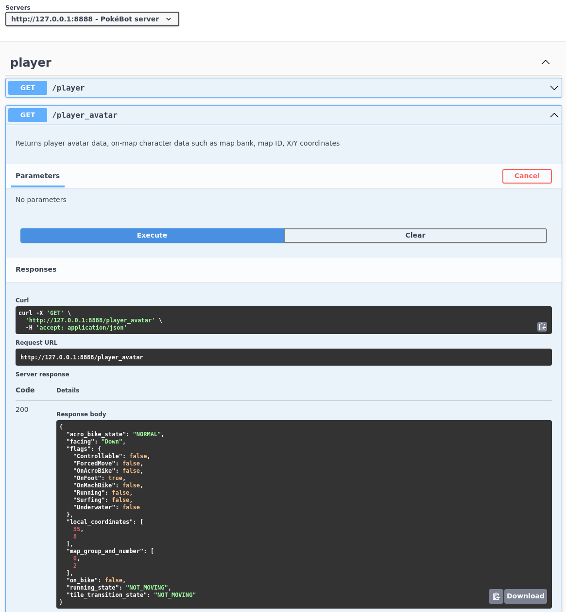

# PokéBot Gen3 (libmgba)
  

 

**PokéBot Gen3** is a shiny hunting bot, written in Python that runs `libmgba` + mGBA Python bindings under the hood. Pokémon Ruby, Sapphire, Emerald, FireRed and LeafGreen are supported. 

Initially created to complete a Prof. Oak and Living ✨Shiny✨ Dex Challenge in Pokémon Emerald, a 24/7 livestream of the challenge can be found ongoing [here](https://www.youtube.com/watch?v=W6OOnrx8g58).

# ✨ Preamble
This bot is still in development, as such, functionality is subject to change - always make sure you back up your `./profiles` folders before updating your bot! 

The bot is frame perfect and can _technically_ cheat by reading data from any point in memory and manipulating RNG. By default it will attempt to perform actions as if a human were playing to make gameplay as representative as possible, some examples:
- Starter Pokémon are generated just _1 frame_ after confirming the starter selection, the bot will wait until the battle begins, and the starter Pokémon sprite is visible before resetting
- It's possible to peek inside un-hatched eggs to view stats and shininess as soon as they're received from the daycare, the bot will wait until the eggs are fully hatched before checking and logging
- Feebas tile locations could be instantly located by reading memory, the bot will attempt to locate the tiles by searching each tile individually

# ❓ Getting Started
Visit the [wiki](wiki/Readme.md) for information getting started, keybinds/inputs, bot modes, configuration files and more!

# 😎 Showcase

|              Main interface              |              Load save state              |              Debug mode              |
|:----------------------------------------:|:-----------------------------------------:|:------------------------------------:|
|  |  |  |

| Capture GIF of shiny encounters          |
|------------------------------------------|
|  |

|             Discord shiny notifications              |              Discord phase stats              |              Discord milestones              |
|:----------------------------------------------------:|:---------------------------------------------:|:--------------------------------------------:|
|  |  |  |

| Automatically saves PKHeX .pk3 file | HTTP API                           |
|-------------------------------------|------------------------------------|
|  |  |

# ❤ Attributions

Core functionality:

- [mGBA](https://github.com/mgba-emu/mgba)
- [libmgba-py](https://github.com/hanzi/libmgba-py/)

Other awesome PokéBot projects:

- [PokéBot NDS](https://github.com/wyanido/pokebot-nds/)

Decompiled symbol tables and other various data from the following projects:

- [Pokémon Emerald decompilation](https://github.com/pret/pokeemerald) ([symbols](https://github.com/pret/pokeemerald/tree/symbols))
- [Pokémon Ruby and Sapphire decompilation](https://github.com/pret/pokeruby) ([symbols](https://github.com/pret/pokeruby/tree/symbols))
- [Pokémon FireRed and LeafGreen decompilation](https://github.com/pret/pokefirered) ([symbols](https://github.com/pret/pokefirered/tree/symbols))

Test save states and bot profiles:

- [Johnnie's PokéBot-Profiles](https://github.com/johnnieb333/Pokebot-Profiles)
