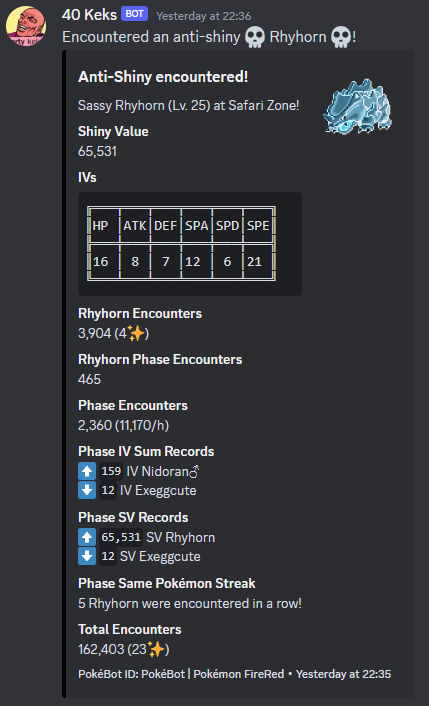

🏠 [`pokebot-gen3` Wiki Home](../Readme.md)

# 📢 Discord Integration Config

[`profiles/discord.yml`](../../profiles/discord.yml)

With Discord integrations, you can receive shiny notifications, phase stats and milestones and more.

For privacy reasons, rich presence and webhooks are all **disabled** by default.

## Discord rich presence
`rich_presence` - display information on your Discord profile such as game, route, total encounters, total shinies and encounter rate. Discord must be installed and signed in on the computer that is running the bot, and should only be enabled for a single bot profile.

## Discord webhooks
`global_webhook_url` - global Discord webhook URL, default webhook for all Discord webhooks unless specified otherwise
- Generate a new webhook: **Edit Channel** > **Integrations** > **Webhooks** > **New Webhook** > **Give it any name such as `PokéBot` and a picture** > **Copy Webhook URL**
- ⚠ **Warning**: this webhook is considered sensitive! If you leak your webhook, anyone will be able to post in your channel

`iv_format` - changes IV formatting displayed in messages, set to `basic` or `formatted`
- `basic`: <br>`HP: 31 | ATK: 31 | DEF: 31  | SPA: 31  | SPD: 31  | SPE: 31`

- `formatted`:
  ```
  ╔═══╤═══╤═══╤═══╤═══╤═══╗
  ║HP │ATK│DEF│SPA│SPD│SPE║
  ╠═══╪═══╪═══╪═══╪═══╪═══╣
  ║31 │31 │31 │31 │31 │31 ║
  ╚═══╧═══╧═══╧═══╧═══╧═══╝
  ```

`bot_id` - set to any string you want, this string is added to the footer of all Discord messages, it can be useful to identify bots if multiple are set to post in the same channel

### Webhook parameters
`enable` - toggle the webhook on/off

`webhook_url` - set to post specific message types to different channels, defaults to `global_webhook_url` if not set
- Commented out in config file by default, remove the leading `#` to uncomment

Each webhook type also supports pinging @users or @roles.

`ping_mode` - set to `user` or `role`
- Leave blank to disable pings

`ping_id` - set to user/role ID
- **Settings** > **Advanced** > Enable **Developer Mode** to enable Discord developer mode
- Right click **user/role** > **Copy ID**

### Webhook types
`shiny_pokemon_encounter` - Shiny Pokémon encounters


***

`pokemon_encounter_milestones` - Pokémon encounter milestones messages every `interval` encounters


***

`shiny_pokemon_encounter_milestones` - Shiny Pokémon encounter milestones every `interval` encounters


***

`total_encounter_milestones` - Total encounter milestones every `interval` encounters


***

`phase_summary` - Phase summary, first summary at `first_interval`, then every `consequent_interval` after that


***

`anti_shiny_pokemon_encounter` - Anti-shiny Pokémon encounters
- Anti-shinies are just a bit of fun, they are mathematically, the complete opposite of a shiny
- An [SV](https://bulbapedia.bulbagarden.net/wiki/Personality_value#Shininess) of `65,528` to `65,535` is considered anti-shiny



***

`custom_filter_pokemon_encounter` - Custom catch filter encounters


***

`pickup` - Pickup notification + summary of items every `interval` new items


