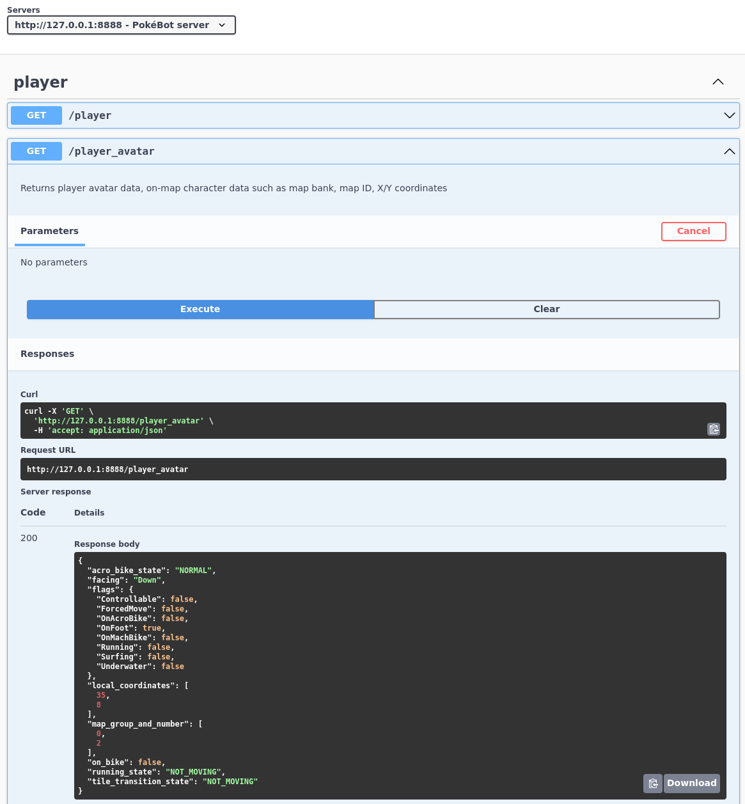

🏠 [`pokebot-gen3` Wiki Home](../Readme.md)

# 🎥 OBS and HTTP Server Config

[`profiles/obs.yml`](https://github.com/40Cakes/pokebot-gen3/blob/main/profiles/obs.yml)

This configuration can be used to drive stream overlays and web UIs.

**Note**: OBS features are very buggy and barely tested.

## OBS
### OBS WebSocket Server Settings
The `obs_websocket` config will allow the bot to send commands to OBS via WebSockets,
see [here](https://github.com/obsproject/obs-websocket) for more information on OBS WebSockets.

Enable WebSockets in **OBS** > **Tools** > **Websocket Server Settings** > **Enable WebSocket Server**

`host` - hostname/IP address OBS WebSockets is listening on

`port` - TCP port OBS WebSockets is listening on

`password` - password to authenticate to WebSocket server (**required**)

### OBS WebSocket Parameters
`shiny_delay` - delay catching a shiny encounter by `n` frames, useful to give you viewers some time to react before saving a replay

`discord_delay` - delay Discord webhooks by `n` seconds, prevent spoilers if there is a stream delay

`screenshot` - take OBS screenshot of shiny encounter
- **Note**: **OBS** > **Settings** > **Hotkeys** > **Screenshot Output** must be set to **Ctrl + F11**
- The bot does **not** emulate keystrokes, it simply sends a `TriggerHotkeyByKeySequence` (**Ctrl + F11**) WebSocket command
- Screenshot is taken after `shiny_delay` to allow stream overlays to update

`replay_buffer` - save OBS replay buffer after `replay_buffer_delay`
- **Note**: **OBS** > **Settings** > **Hotkeys** > **Replay Buffer** > **Save Replay** must set to **Ctrl + F12**
- The bot does **not** emulate keystrokes, it simply sends a `TriggerHotkeyByKeySequence` (**Ctrl + F12**) WebSocket command

`replay_buffer_delay` - delay saving OBS replay buffer by `n` seconds
- Runs in a separate thread and will not pause main bot thread
- If the replay buffer is long enough, it will also capture some encounters after the shiny encounter

`discord_webhook_url` - Discord webhook URL to post OBS `screenshot`, after a shiny encounter

`replay_dir` - OBS screenshot/replay buffer folder
- **OBS** > **Settings** > **Output** > **Recording** > **Recording Path**
- Relative folder to `pokebot.py`, this is used to post stream `screenshot` to Discord if `discord_webhook_url` is set

## HTTP server
The `http_server` config will enable a Flask HTTP server, which can be used to retrieve data and drive stream overlays.

`enable` - toggle web server on/off

`ip` - IP address for server to listen on

`port` - TCP port for server to listen on
- Port must be unique for each bot instance

### HTTP Endpoints
The bot has a Flask HTTP server that can serve lots of data about the running emulator the current profile.

The following pages are available if the HTTP server is enabled:
- Test UI: [http://127.0.0.1:8888/](http://127.0.0.1:8888/)
- Swagger UI (API Documentation): [http://127.0.0.1:8888/docs/](http://127.0.0.1:8888/docs/)

