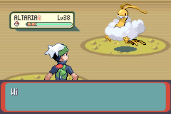
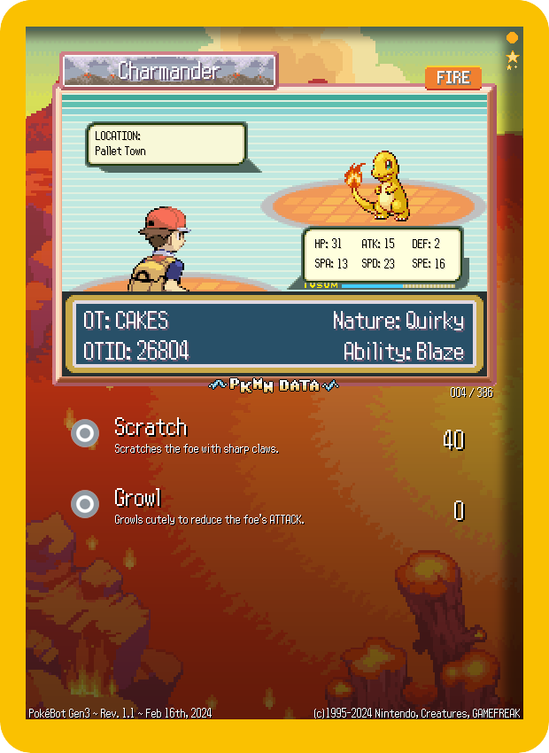

🏠 [`pokebot-gen3` Wiki Home](../Readme.md)

# 📄 Console, Logging and Image Config

[`profiles/logging.yml`](../../modules/config/templates/logging.yml)

This file allows you to enable or disable features of the bot that may generate data or images, such as .csv data logging, .pk3 dumping or shiny GIFs.

## Logging

### Options
`log_encounters` - (Can be `true` or `false`.)   
Log _all_ encounters (and not just shiny ones) to the stats database.  
This doesn't impact performance much, but it means that the database file (`profiles/<profile name>/stats.db`) will grow much quicker.   
It adds about 200 byte for each encounter. So for each 1 million encounters, the database would have a size of about 190 MB.

`desktop_notifications` - (Can be `true` or `false`.)   
Show a desktop notification if a shiny, roamer, or Pokémon matching your  Custom Catch Filters is encountered, or the bot is switched to manual mode.

`log_encounters_to_console` - (Can be `true` or `false`.)   
Display information about wild encounters (and gift Pokémon) as well as your current phase statistics to the console.

## Save raw Pokémon data (.pk3)
The bot can dump individual Pokémon files (.pk3 format) to be managed/transferred in the [PKHeX save editor](https://github.com/kwsch/PKHeX).

The Pokémon are dumped to the `./profile/<profile_name>/stats/pokemon/` folder, in the following format:

`273 ★ - SEEDOT - Modest [180] - C88CF14B19C6.pk3` (`<nat_dex_num> <shiny ★> - <mon_name> - <nature> [<IV sum>] - <pid>.pk3`)

### Options
`save_pk3`: (each option can be either `true` or `false`.)
- `shiny` - Create .pk3 files for Shiny encounters
- `custom` - Create .pk3 files for Pokémon that match your custom catch filters.
- `roamer` - Create .pk3 files for the Roaming Pokémon (Latias/Latios on R/S/E, Entei/Raikou/Suicine on FR/LG) the first time it is encountered.

Feel free to share any rare/interesting .pk3 files in [#pkhexchange💱](https://discord.com/channels/1057088810950860850/1123523909745135616)!

## Shiny GIFs
Capture and save a GIF of shiny encounters, example GIF below. If shiny [Discord webhooks](Configuration%20-%20Discord%20Integration.md) are enabled, the GIF will also be added to the webhook!

Shiny GIFs are saved to the `./profile/<profile_name>/screenshots/gif/` folder.

`shiny_gifs` - (Can be `true` or `false`.)

## TCG Cards
Creates fun (fake) TCG cards for all shiny encounters and shiny evolutions, example card below.

TCG cards are saved to the `./profile/<profile_name>/screenshots/cards/` folder.

- The card theme is based on the encounter's primary type
- Shinies are denoted by the shiny stars (top right)
- Origin game is denoted by the coloured shape (top right):
  - Blue square: Sapphire
  - Red square: Ruby
  - Green square: Emerald
  - Orange circle: FireRed
  - Green circle: LeafGreen
- National dex number (`004 / 386`) is bottom right of portrait
- The cyan exp bar is based on the encounter's % of max IV sum (186)

`tcg_cards` - (Can be `true` or `false`.)

