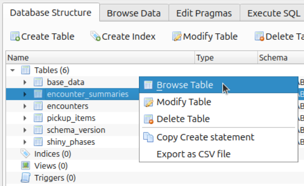

🏠 [`pokebot-gen3` Wiki Home](../Readme.md)

# 📊 Statistics Database

The bot stores its statistics in an sqlite3 database. This file can be found in the
profile directory, at `profiles/<profile name>/stats.db`.

This contains 4 main tables:

- **encounters** contains information about encountered Pokémon. If `log_encounters` is
  enabled (see [the Wiki page on logging](Console,%20Logging%20and%20Image%20Config.md)),
  this will contain _all_ encountered Pokémon. Otherwise it just contains shinies,
  roaming Pokémon as well as Pokémon that matched a custom catch filter.
- **shiny_phases** contains information about Shiny Phases, etc. the time periods between
  two shiny encounters.
- **encounter_summaries** contains information for each species (and in case of Unown, for
  each single letter) the bot has encountered in this profile and so can answer questions
  like 'How many Seedot have we encountered in total?' By summing all those individual
  species entries you get the total stats.
- **pickup_items** contains a list of items that have been acquired using the Pickup ability,
  and how many of them have been picked up so far.

## Viewing and modifying the database

Since the database file is just a regular sqlite3 database, anything that can open these
will work fine. But assuming you don't have any experience with that, here are some pointers
on how to do some simple tasks.

**Whatever you do, make a backup copy of your `stats.db` file first!** Modifying the database
file in a wrong way can cause your stats to be lost, and/or the bot to crash. If that happens,
just move that backup file to its original place.

### Opening the database

One of many tools for dealing with sqlite databases is [DB Browser for SQLite](https://sqlitebrowser.org/)
which exists for a variety of operating systems.

1. **Close the bot** (a database file can only be opened by _one_ program.)
2. Press the 'Open Database' button in the top left of that software (or press `Ctrl+O`),
   search for your profile directory and open the `stats.db` therein. (Remember to make a
   backup before!)
3. Do whatever you wish to do (examples below)
4. If you've made some changes, click 'Write Changes' (or press `Ctrl+S`) to write those
   to the file.
5. **Click 'Close Database'** (or `Ctrl+F4`). This is important, otherwise the bot will
  likely show a `Database is locked` error (because it is still open in another program.)

### Example: Export stats as CSV or JSON

If you prefer working with CSV or JSON files, you can export them by clicking `File` in the
top left corner of the window, and then select `Export` and `Table(s) as JSON...` or
`Table(s) as CSV file...`.

This will show a dialogue where you can choose which tables you're interested in (see above
for descriptions on what they contain) and where to save them.

### Example: Increase or decrease encounter numbers or other species-related values

Right click the `encounter_summaries` table and choose 'Browse Table':

Here you can modify the per-species statistics and update the number of encounters, shinies
encountered, etc.

Don't forget to press `Ctrl+S`/'Write Changes' once you're done, and **remember to create
a backup before you do this.**
