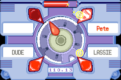
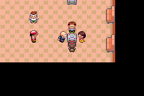

🏠 [`pokebot-gen3` Wiki Home](../Readme.md)

# 🍓 Berry Blender Mode

This mode will play the Berry Blender minigame with 100% accuracy.

To run it, stand in front of one of the Berry Blender tables (must be
one with 1-3 NPCs around it as the empty ones are for multiplayer only.)

## Game Support
|          | 🟥 Ruby | 🔷 Sapphire | 🟢 Emerald |
|:---------|:-------:|:-----------:|:----------:|
| English  |    ✅    |      ✅      |     ✅      |
| Japanese |    ✅    |      ✅      |     ✅      |
| German   |    ✅    |      ✅      |     ✅      |
| Spanish  |    ✅    |      ✅      |     ✅      |
| French   |    ✅    |      ✅      |     ✅      |
| Italian  |    ✅    |      ✅      |     ✅      |

✅ Tested, working

🟨 Untested, may not work

❌ Untested, not working
