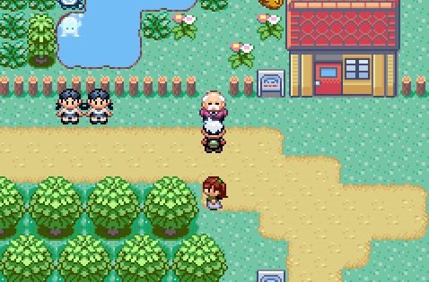

🏠 [`pokebot-gen3` Wiki Home](../Readme.md)

# 🥚 Daycare Mode

⚠️ Warning: If you start this mode with more than **one** Pokémon in your party, it _will_ be released.

## Requirements

- A compatible breeding couple in the Daycare
- [Mach Bike](https://bulbapedia.bulbagarden.net/wiki/Mach_Bike) registered to Select
- 1 Pokémon in your Party, ideally with Flame Body or Magma Armor ability.
- Defeated all trainers on [Route 117](https://bulbapedia.bulbagarden.net/wiki/Hoenn_Route_117) (Preferred)

## Instructions

Start this mode facing the Daycare man **when he is stood on the tile shown below**. He _must_ be stood on the tile shown below, otherwise the Bot will not speak to him to collect more eggs.

If he is not on this tile, simply cycle left and right, ensuring you leave Route 117 until he moves, when an egg is ready.

The bot will collect up to five eggs, and once all have hatched, release them in the Daycare PC.

## Game Support

|          | 🟥 Ruby | 🔷 Sapphire | 🟢 Emerald | 🔥 FireRed | 🌿 LeafGreen |
| :------- | :-----: | :---------: | :--------: | :--------: | :----------: |
| English  |   🟨    |     🟨      |     ✅     |     ❌     |      ❌      |
| Japanese |   ❌    |     ❌      |     ❌     |     ❌     |      ❌      |
| German   |   ❌    |     ❌      |     ❌     |     ❌     |      ❌      |
| Spanish  |   ❌    |     ❌      |     ❌     |     ❌     |      ❌      |
| French   |   ❌    |     ❌      |     ❌     |     ❌     |      ❌      |
| Italian  |   ❌    |     ❌      |     ❌     |     ❌     |      ❌      |

✅ Supported (tested)

🟨 Supported (not tested)

❌ Not supported
