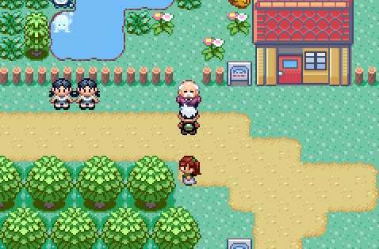

🏠 [`pokebot-gen3` Wiki Home](../Readme.md)

# 🥚 Daycare Mode

## Requirements

- A compatible breeding couple in the Daycare

### Optional, but recommended
- (Emerald only) Having a Pokémon with [Flame Body](https://bulbapedia.bulbagarden.net/wiki/Flame_Body_(Ability)) or [Magma Armor](https://bulbapedia.bulbagarden.net/wiki/Magma_Armor_(Ability)) ability in your
  party (even if it's fained) halves the number of steps required. 
- [Mach Bike](https://bulbapedia.bulbagarden.net/wiki/Mach_Bike) (R/S/E) or [Bicycle](https://bulbapedia.bulbagarden.net/wiki/Bicycle) (FR/LG) registered to `Select` will help getting
  those steps in quicker.

## Instructions

For soft-resetting a ready Daycare egg before hatching, use [Daycare Soft Resets](Mode%20-%20Daycare%20Soft%20Resets.md).

Start this mode while being on Route 117 (in R/S/E) or Sevii Island Four (FR/LG), the bot will
collect up to five eggs, and once all have hatched, release them in the Daycare PC if they're
not Shiny.

## Game Support

|          | 🟥 Ruby | 🔷 Sapphire | 🟢 Emerald | 🔥 FireRed | 🌿 LeafGreen |
|:---------|:-------:|:-----------:|:----------:|:----------:|:------------:|
| English  |    ✅    |      ✅      |     ✅      |     ✅      |      ✅       |
| Japanese |    ✅    |      ✅      |     ✅      |     ✅      |      ✅       |
| German   |    ✅    |      ✅      |     ✅      |     ✅      |      ✅       |
| Spanish  |    ✅    |      ✅      |     ✅      |     ✅      |      ✅       |
| French   |    ✅    |      ✅      |     ✅      |     ✅      |      ✅       |
| Italian  |    ✅    |      ✅      |     ✅      |     ✅      |      ✅       |

✅ Tested, working

🟨 Untested, may not work

❌ Untested, not working
