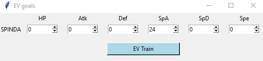

🏠 [`pokebot-gen3` Wiki Home](../Readme.md)

# 💊 EV Train Mode

This mode will continuously fight battles in order to EV Train your lead Pokémon.
If the lead is unable to battle, the mode will swap to another mon in the party if
that is enabled in the profile battle settings (see
[⚔ Battling and Pickup config](Configuration%20-%20Battling%20and%20Pickup.md)).
This is useful for training weak mons, but keep in mind it will alter the EVs of
the mon switched to. The mode only tracks the lead's EVs and does not switch the
lead outside of battle.

When the active Pokémon is defeated or gets low on HP, it will heal at the nearest
Pokémon Center automatically. Likewise, if your entire party gets defeated it will
just return to the Tall Grass spot you've picked. So this mode should be pretty much
hands-off.

Should this mode encounter a Shiny or a Pokémon that matches your custom catch filters,
it will **not** battle it but instead either catch it automatically (if auto-catching is
enabled in your configuration) or put the bot back into manual mode. So you don't have to
worry about missing out on a Shiny.

## Instructions

Start this mode while standing somewhere in tall grass that has a _direct_ overworld
connection to a Pokémon Center (i.e. it must be possible to walk to the PC without
going through any buildings.)

If the mode is not available for selection, that means that this route is not supported.
Try another route that has an easy overland path to a Pokémon Center.

After selecting the mode, enter the desired EV spread in the GUI window. 

## FireRed and LeafGreen

The following routes are supported:

- Route 1
- Route 2
- Route 3
- Route 4
- Route 6
- Route 7
- Route 9
- Route 10
- Route 11
- Route 18
- Route 22
- Route 24

## Emerald

The following routes are supported:

- Route 101
- Route 102
- Route 103
- Route 104
- Route 110
- Route 113
- Route 114
- Route 116
- Route 117
- Route 119
- Route 120
- Route 121

## Game Support

|          | 🟥 Ruby | 🔷 Sapphire | 🟢 Emerald | 🔥 FireRed | 🌿 LeafGreen |
|:---------|:-------:|:-----------:|:----------:|:----------:|:------------:|
| English  |    ✅    |      ✅      |     ✅      |     ✅      |      ✅       |
| Japanese |    ❌    |      ❌      |     ✅      |     ✅      |      ✅       |
| German   |    ❌    |      ❌      |     ✅      |     ✅      |      ✅       |
| Spanish  |    ❌    |      ❌      |     ✅      |     ✅      |      ✅       |
| French   |    ❌    |      ❌      |     ✅      |     ✅      |      ✅       |
| Italian  |    ❌    |      ❌      |     ✅      |     ✅      |      ✅       |

✅ Tested, working

🟨 Untested, may not work

❌ Untested, not working
