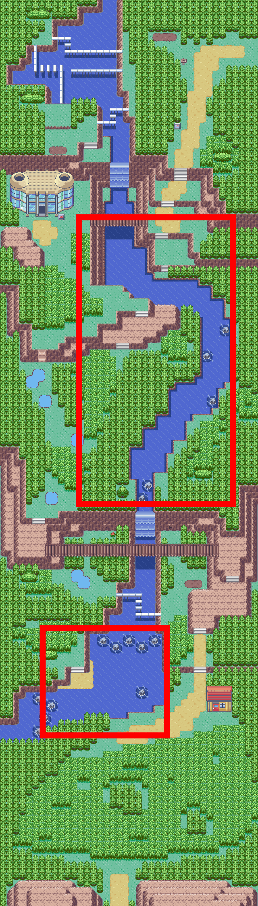
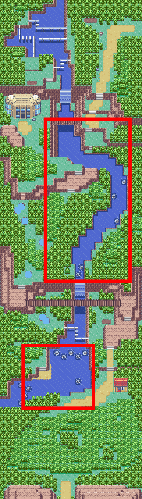

🏠 [`pokebot-gen3` Wiki Home](../Readme.md)

# 🐟 Feebas Mode

Feebas mode will search for the illusive fish by navigating to and fishing on all tiles in the current body of water. Once Feebas is found, the bot will stay at the tile and continue to hunt for shiny [Feebas](https://bulbapedia.bulbagarden.net/wiki/Feebas_(Pok%C3%A9mon)).

The fishing spots Feebas is found in are randomly generated in Generation 3. In Ruby, Sapphire, and Emerald they randomly change whenever the [trend](https://bulbapedia.bulbagarden.net/wiki/Trend) in [Dewford Town](https://bulbapedia.bulbagarden.net/wiki/Dewford_Town) changes.

Notes:
- There are 2 large lakes of water on Route 119, the bot will only hunt on the lake it is started on and will not automatically move to a different lake
- Navigating under the bridges that are over the water is currently an issue and the bot may get stuck, it is not recommended to run the bot near the bridge (north lake)
- The bot will not automatically travel up the waterfall

Each tile will be fished on `3` times, meaning if Feebas is not encountered on a particular tile, the tile can be ruled out with `87.5%` confidence.

If Feebas is not encountered for `20` encounters after the last, it will be assumed that the tiles were randomised and the bot will search for the new tile.

| Encounters | Confidence |
|------------|------------|
| `1`        | `50%`      |
| `2`        | `75%`      |
| `3`        | `87.5%`    |
| `4`        | `93.75%`   |
| `5`        | `96.875%`  |

- (Recommended) The first Pokémon in the party (can be fainted) should have the ability [Sticky Hold](https://bulbapedia.bulbagarden.net/wiki/Sticky_Hold_(Ability)) or [Suction Cups](https://bulbapedia.bulbagarden.net/wiki/Suction_Cups_(Ability)) to increase the bite rate while fishing
- Old Rod (the bot will automatically register Old Rod to `Select` button)
  - The Old Rod has the advantage of immediately giving you an encounter as soon as you get a bite
- Place the player on any body of water (surf) on Route 119 and face a fishable tile
- Start mode

## Route 119

The lakes marked in red are highly likely to contain a Feebas tile.

| Ruby/Sapphire                          | Emerald                         |
|----------------------------------------|---------------------------------|
|  |   |

# Game Support
|          | 🟥 Ruby | 🔷 Sapphire | 🟢 Emerald |
|:---------|:-------:|:-----------:|:----------:|
| English  |    ✅    |      ✅      |     ✅      |
| Japanese |    ❌    |      ❌      |     ❌      |
| German   |    ❌    |      ❌      |     ❌      |
| Spanish  |    ❌    |      ❌      |     ❌      |
| French   |    ❌    |      ❌      |     ❌      |
| Italian  |    ❌    |      ❌      |     ❌      |

✅ Supported (tested)

🟨 Supported (not tested)

❌ Not supported
