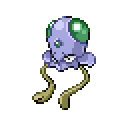
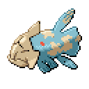

🏠 [`pokebot-gen3` Wiki Home](../Readme.md)

# 🎣 Fishing Mode

Fishing is a way to use a fishing rod to catch wild Pokémon in the water. Some Pokémon can only be caught by using a fishing rod.

- (Recommended) The first Pokémon in the party (can be fainted) should have the ability [Sticky Hold](https://bulbapedia.bulbagarden.net/wiki/Sticky_Hold_(Ability)) or [Suction Cups](https://bulbapedia.bulbagarden.net/wiki/Suction_Cups_(Ability)) to increase the bite rate while fishing
- Register any fishing rod and start the mode while facing water

## Game Support
|          | 🟥 Ruby | 🔷 Sapphire | 🟢 Emerald | 🔥 FireRed | 🌿 LeafGreen |
|:---------|:-------:|:-----------:|:----------:|:----------:|:------------:|
| English  |    ✅    |      ✅      |     ✅      |     ✅      |      ✅       |
| Japanese |    ❌    |      ❌      |     ✅      |     ❌      |      ❌       |
| German   |    ❌    |      ❌      |     ✅      |     ✅      |      ❌       |
| Spanish  |    ❌    |      ❌      |     ✅      |     ✅      |      ❌       |
| French   |    ❌    |      ❌      |     ✅      |     ✅      |      ❌       |
| Italian  |    ❌    |      ❌      |     ✅      |     ✅      |      ❌       |

✅ Tested, working

🟨 Untested, may not work

❌ Untested, not working