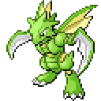

🏠 [`pokebot-gen3` Wiki Home](../Readme.md)

# 🎰 Game Corner Mode

    

Soft resets for a Pokémon purchased from the [Celadon Game Corner](https://bulbapedia.bulbagarden.net/wiki/Celadon_Game_Corner).

- Place the player facing NPC that sells Pokémon
- Save the game (**in-game, not a save state**)
- Select `Game Corner` mode
- Select a Pokémon from the selection menu

| [Abra](https://bulbapedia.bulbagarden.net/wiki/Abra_(Pok%C3%A9mon))   | [Clefairy](https://bulbapedia.bulbagarden.net/wiki/Clefairy_(Pok%C3%A9mon)) | [Dratini](https://bulbapedia.bulbagarden.net/wiki/Dratini_(Pok%C3%A9mon)) | [Scyther](https://bulbapedia.bulbagarden.net/wiki/Scyther_(Pok%C3%A9mon)) | [Porygon](https://bulbapedia.bulbagarden.net/wiki/Porygon_(Pok%C3%A9mon)) |
|-----------------------------------------------------------------------|-----------------------------------------------------------------------------|---------------------------------------------------------------------------|---------------------------------------------------------------------------|---------------------------------------------------------------------------|
| 150 coins                                                             | 500 coins                                                                   | 2,800 coins                                                               | 5,500 coins                                                               | 9,999 coins                                                               |

## Game Support
|          | 🔥 FireRed | 🌿 LeafGreen |
|:---------|:----------:|:------------:|
| English  |     ✅      |      ✅       |
| Japanese |     🟨     |      🟨      |
| German   |     🟨     |      🟨      |
| Spanish  |     🟨     |      🟨      |
| French   |     🟨     |      🟨      |
| Italian  |     🟨     |      🟨      |

✅ Supported (tested)

🟨 Supported (not tested)

❌ Not supported