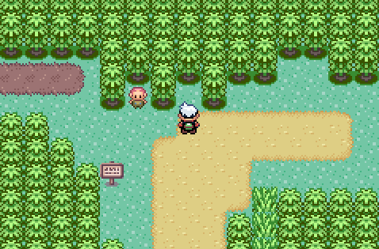

🏠 [`pokebot-gen3` Wiki Home](../Readme.md)

# 🎨 Kecleon

Kecleon mode will self-destruct on the Kecleon just west of Fortree City.
The mode checks that you have not already defeated this one, if you have, you will need to Spin in grass for the 1% encounter rate.

### Requirements

- Play on Emerald (in Ruby and Sapphire, the Kecleon disappears even after a defeat so this mode cannot be used)
- Received the [Devon Scope](https://bulbapedia.bulbagarden.net/wiki/Devon_Scope)
- Single Pokémon in your party with [Selfdestruct](<https://bulbapedia.bulbagarden.net/wiki/Self-Destruct_(move)>) in the _first_ move slot.
- Have not defeated/captured the Kecleon on Route 119.
- Last healed Pokémon center is Fortree City

### Where to start

Start the mode facing the invisible Kecleon on Route 119.

## Game Support

|          | 🟥 Ruby | 🔷 Sapphire | 🟢 Emerald |
|:---------|:-------:|:-----------:|:----------:|
| English  |    ❌    |      ❌      |     ✅      |
| Japanese |    ❌    |      ❌      |     ❌      |
| German   |    ❌    |      ❌      |     ❌      |
| Spanish  |    ❌    |      ❌      |     ❌      |
| French   |    ❌    |      ❌      |     ❌      |
| Italian  |    ❌    |      ❌      |     ❌      |

✅ Tested, working

🟨 Untested, may not work

❌ Untested, not working
