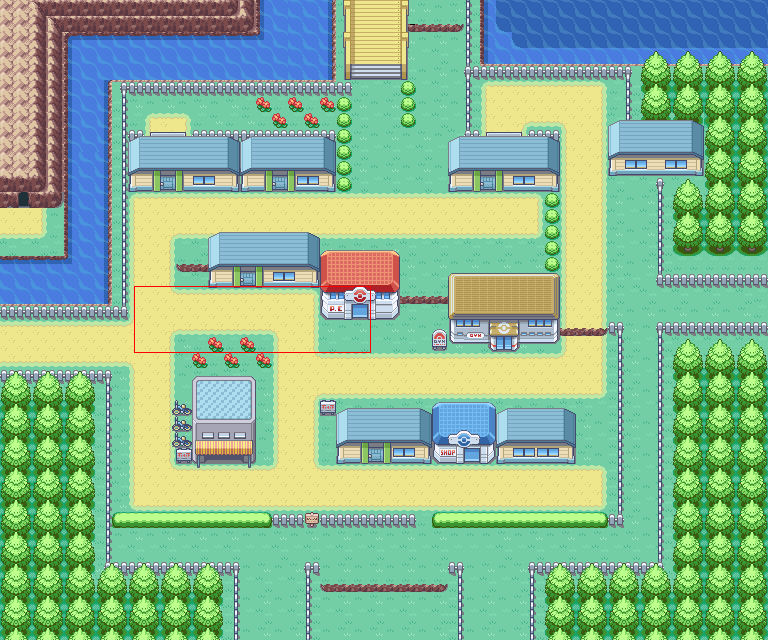
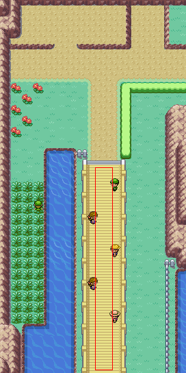

# 🟡 Nugget Bridge Mode

Nugget Bridge mode takes advantage of a coding oversight in Generation 3 Kanto games.     
The oversight allows infinite Nuggets to be obtained from the rocket at the end of Nugget Bridge. See [here](https://bulbapedia.bulbagarden.net/wiki/List_of_glitches_(Generation_III)#Nugget_Bridge_script_oversight) for more information.

The bot will repeatedly battle and white-out to the Rocket trainer, so any money you have will be lost, however each nugget nets ₽5,000 profit.

## Requirements
- Defeated all Nugget Bridge trainers _except_ the Rocket trainer at the end
- 1 Pokémon in your party
- Low level Pokémon (level 6 or below)
    - Obtain level 6 Pokémon on [Route 4](https://bulbapedia.bulbagarden.net/wiki/Kanto_Route_4)

## Instructions
- Start mode either outside Cerulean City Poké Center, or on Nugget Bridge
- ???
- Profit!

