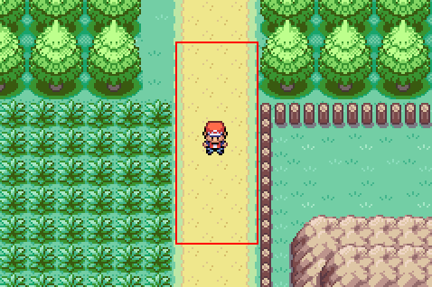
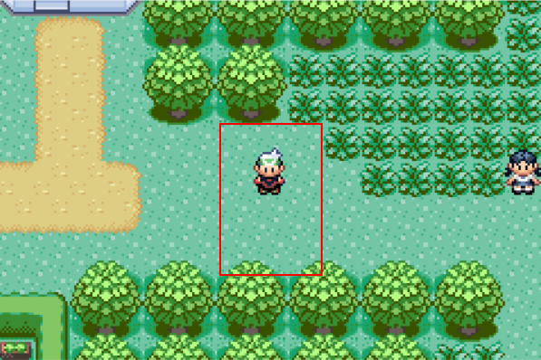

🏠 [`pokebot-gen3` Wiki Home](../Readme.md)

# 🔄️ Pokécenter Loop Mode

## Requirements

- Set battle to True in the ⚔ [Battling and Pickup](Configuration%20-%20Battling%20and%20Pickup.md) config

## Instructions

Start this mode while being on Route 102 (in E) or Route 2 (FR/LG), the bot will automatically go to the Pokécenter and heal, return to the route untill it runs from battle and then repeat.

## FireRed and LeafGreen

Start the bot here for the Route 2 to Pewter City loop

## Emerald

Start the bot here for the Route 102 to Petalburg loop

## Game Support

|          | 🟥 Ruby | 🔷 Sapphire | 🟢 Emerald | 🔥 FireRed | 🌿 LeafGreen |
| :------- | :-----: | :---------: | :--------: | :--------: | :----------: |
| English  |   ❌    |     ❌      |     ✅     |     ✅     |      ✅      |
| Japanese |   ❌    |     ❌      |     ❌     |     ❌     |      ❌      |
| German   |   ❌    |     ❌      |     ❌     |     ❌     |      ❌      |
| Spanish  |   ❌    |     ❌      |     ❌     |     ❌     |      ❌      |
| French   |   ❌    |     ❌      |     ❌     |     ❌     |      ❌      |
| Italian  |   ❌    |     ❌      |     ❌     |     ❌     |      ❌      |

✅ Tested, working

🟨 Untested, may not work

❌ Untested, not working
