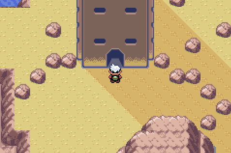
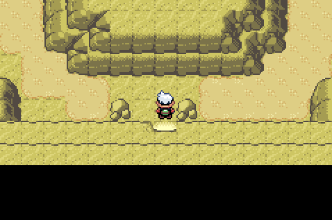
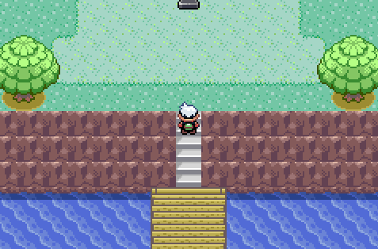
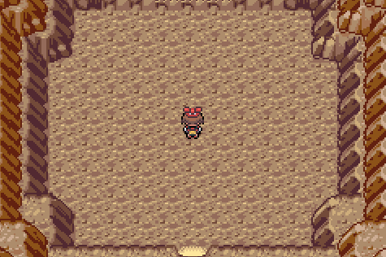

🏠 [`pokebot-gen3` Wiki Home](../Readme.md)

# 🧩 Puzzle Solver Mode

Puzzle solver mode was created because we all hate Sky Pillar. That is all.

The following puzzles can be solved with this mode:

## Sky Pillar

Automatically navigates to the top of [Sky Pillar](https://bulbapedia.bulbagarden.net/wiki/Sky_Pillar).

### Requirements
- [Repel](https://bulbapedia.bulbagarden.net/wiki/Repel), [Super Repel](https://bulbapedia.bulbagarden.net/wiki/Super_Repel), or [Max Repel](https://bulbapedia.bulbagarden.net/wiki/Max_Repel) stock in your bag. If you runs out of repel steps, it will re-apply
- [Mach Bike](https://bulbapedia.bulbagarden.net/wiki/Mach_Bike) registered to the `Select` button

### Starting Location
Start bot mode just _outside_ Sky Pillar.

## Mirage Tower

Automatically navigates to the [Root Fossil](https://bulbapedia.bulbagarden.net/wiki/Root_Fossil) and a [Claw Fossil](https://bulbapedia.bulbagarden.net/wiki/Claw_Fossil) in [Mirage Tower](https://bulbapedia.bulbagarden.net/wiki/Mirage_Tower).

### Requirements
- [Repel](https://bulbapedia.bulbagarden.net/wiki/Repel), [Super Repel](https://bulbapedia.bulbagarden.net/wiki/Super_Repel), or [Max Repel](https://bulbapedia.bulbagarden.net/wiki/Max_Repel) stock in your bag. If it runs out of repel steps, it will re-apply
- [Mach Bike](https://bulbapedia.bulbagarden.net/wiki/Mach_Bike) registered to the `Select` button
- [Dynamo Badge](https://bulbapedia.bulbagarden.net/wiki/Badge#Dynamo_Badge) and a Pokémon with [Rock Smash](https://bulbapedia.bulbagarden.net/wiki/Rock_Smash_(move))

### Starting Location
Start bot mode in this spot, just inside the tower.

## Deoxys

Solves the puzzle before encountering Deoxys on [Birth Island](https://bulbapedia.bulbagarden.net/wiki/Birth_Island).

### Requirements
- [Aurora Ticket](https://bulbapedia.bulbagarden.net/wiki/AuroraTicket) to access Birth Island

### Starting Location

## Regice

For [Regice](https://bulbapedia.bulbagarden.net/wiki/Regice_(Pok%C3%A9mon)), start the bot mode _inside_ [Island Cave](https://bulbapedia.bulbagarden.net/wiki/Island_Cave).

- For `Ruby/Sapphire`, the bot will stand still for two minutes of in-game time
- For `Emerald`, the bot will run around the room once

### Requirements
- Completed the initial part of the Regi Puzzle in the [Sealed Chamber](https://bulbapedia.bulbagarden.net/wiki/Sealed_Chamber)

### Starting Location
Start mode in Island Cave.

## Regirock

For [Regirock](https://bulbapedia.bulbagarden.net/wiki/Regirock_(Pok%C3%A9mon)), start the bot mode _inside_ [Desert Ruins](https://bulbapedia.bulbagarden.net/wiki/Desert_Ruins).

### Requirements
Ensure you have a Pokémon with the correct move for your game version, and the relevant gym badge to use it.

| | Ruby | Sapphire | Emerald
|---|---|---|---|
| Required Move | [Strength](https://bulbapedia.bulbagarden.net/wiki/Strength_(move)) | [Strength](https://bulbapedia.bulbagarden.net/wiki/Strength_(move)) | [Rock Smash](https://bulbapedia.bulbagarden.net/wiki/Rock_Smash_(move)) |
| Gym Badge | [Heat Badge](https://bulbapedia.bulbagarden.net/wiki/Badge#Heat_Badge) | [Heat Badge](https://bulbapedia.bulbagarden.net/wiki/Badge#Heat_Badge) | [Dynamo Badge](https://bulbapedia.bulbagarden.net/wiki/Badge#Dynamo_Badge) |

### Starting Location
Start mode in Desert Ruins.

## Registeel

For [Registeel](https://bulbapedia.bulbagarden.net/wiki/Registeel_(Pok%C3%A9mon)), start the bot mode _inside_ the [Ancient Tomb](https://bulbapedia.bulbagarden.net/wiki/Ancient_Tomb).

### Requirements
Ensure you have a Pokémon with the correct move for your game version, and the relevant gym badge to use it.

| | Ruby | Sapphire | Emerald
|---|---|---|---|
| Required Move | [Fly](https://bulbapedia.bulbagarden.net/wiki/Fly_(move)) | [Fly](https://bulbapedia.bulbagarden.net/wiki/Fly_(move)) | [Flash](https://bulbapedia.bulbagarden.net/wiki/Flash_(move)) |
| Gym Badge | [Feather Badge](https://bulbapedia.bulbagarden.net/wiki/Badge#Feather_Badge) | [Feather Badge](https://bulbapedia.bulbagarden.net/wiki/Badge#Feather_Badge) | [Knuckle Badge](https://bulbapedia.bulbagarden.net/wiki/Badge#Knuckle_Badge) |

### Starting Location
Start mode in Ancient Tomb.

# Game Support
|          | 🟥 Ruby | 🔷 Sapphire | 🟢 Emerald |
|:---------|:-------:|:-----------:|:----------:|
| English  |    ✅    |      ✅      |     ✅      |
| Japanese |    ❌    |      ❌      |     ❌      |
| German   |    ❌    |      ❌      |     ❌      |
| Spanish  |    ❌    |      ❌      |     ❌      |
| French   |    ❌    |      ❌      |     ❌      |
| Italian  |    ❌    |      ❌      |     ❌      | 

✅ Supported (tested)

🟨 Supported (not tested)

❌ Not supported
