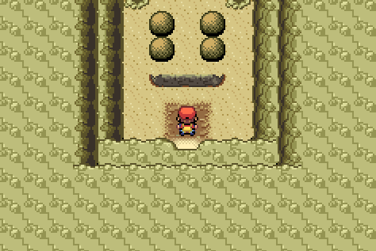

🏠 [`pokebot-gen3` Wiki Home](../Readme.md)

# 🧩 Puzzle Solver Mode

Puzzle solver mode was created because we all hate Sky Pillar. That is all.

The following puzzles can be solved with this mode:

## Sky Pillar

Automatically navigates to the top of [Sky Pillar](https://bulbapedia.bulbagarden.net/wiki/Sky_Pillar).

### Requirements

- [Repel](https://bulbapedia.bulbagarden.net/wiki/Repel), [Super Repel](https://bulbapedia.bulbagarden.net/wiki/Super_Repel), or [Max Repel](https://bulbapedia.bulbagarden.net/wiki/Max_Repel) stock in your bag. If you runs out of repel steps, it will re-apply
- [Mach Bike](https://bulbapedia.bulbagarden.net/wiki/Mach_Bike) registered to the `Select` button

### Starting Location

Start bot mode just _outside_ Sky Pillar.

## Mirage Tower

Automatically navigates to the [Root Fossil](https://bulbapedia.bulbagarden.net/wiki/Root_Fossil) and a [Claw Fossil](https://bulbapedia.bulbagarden.net/wiki/Claw_Fossil) in [Mirage Tower](https://bulbapedia.bulbagarden.net/wiki/Mirage_Tower).

### Requirements

- [Repel](https://bulbapedia.bulbagarden.net/wiki/Repel), [Super Repel](https://bulbapedia.bulbagarden.net/wiki/Super_Repel), or [Max Repel](https://bulbapedia.bulbagarden.net/wiki/Max_Repel) stock in your bag. If it runs out of repel steps, it will re-apply
- [Mach Bike](https://bulbapedia.bulbagarden.net/wiki/Mach_Bike) registered to the `Select` button
- [Dynamo Badge](https://bulbapedia.bulbagarden.net/wiki/Badge#Dynamo_Badge) and a Pokémon with [Rock Smash](<https://bulbapedia.bulbagarden.net/wiki/Rock_Smash_(move)>)

### Starting Location

Start bot mode in this spot, just inside the tower.

## Deoxys

Solves the puzzle before encountering Deoxys on [Birth Island](https://bulbapedia.bulbagarden.net/wiki/Birth_Island).

### Requirements

- [Aurora Ticket](https://bulbapedia.bulbagarden.net/wiki/AuroraTicket) to access Birth Island

### Starting Location

For `Ruby/Sapphire/Emerald`

For `Fire Red / Leaf Green`

## Sealed Chamber (Regi-Trio) Puzzle

Navigates to [Sealed Chamber](https://bulbapedia.bulbagarden.net/wiki/Sealed_Chamber) from [Pacifidlog Town](https://bulbapedia.bulbagarden.net/wiki/Pacifidlog_Town), and solves the puzzle required to access the regi trio.

### Requirements

- Pokemon which knows [Surf](<https://bulbapedia.bulbagarden.net/wiki/Surf_(move)>)
- Pokemon which knows [Dive](<https://bulbapedia.bulbagarden.net/wiki/Dive_(move)>)
- Pokemon which knows [Dig](<https://bulbapedia.bulbagarden.net/wiki/Dig_(move)>)
- Wailord in the **first** party slot (Emerald) or **last** party slot (Ruby/Sapphire)
- Relicanth in the **last** party slot (Emerald) or **first** party slot (Ruby/Sapphire)

### Starting Location

Start anywhere in Pacifidlog town with all of the above requirements fulfilled.

## Regice

For [Regice](<https://bulbapedia.bulbagarden.net/wiki/Regice_(Pok%C3%A9mon)>), start the bot mode _inside_ [Island Cave](https://bulbapedia.bulbagarden.net/wiki/Island_Cave).

- For `Ruby/Sapphire`, the bot will stand still for two minutes of in-game time
- For `Emerald`, the bot will run around the room once

### Requirements

- Completed the initial part of the Regi Puzzle in the [Sealed Chamber](https://bulbapedia.bulbagarden.net/wiki/Sealed_Chamber)

### Starting Location

Start mode in Island Cave.

## Regirock

For [Regirock](<https://bulbapedia.bulbagarden.net/wiki/Regirock_(Pok%C3%A9mon)>), start the bot mode _inside_ [Desert Ruins](https://bulbapedia.bulbagarden.net/wiki/Desert_Ruins).

### Requirements

Ensure you have a Pokémon with the correct move for your game version, and the relevant gym badge to use it.

|               | Ruby                                                                   | Sapphire                                                               | Emerald                                                                    |
| ------------- | ---------------------------------------------------------------------- | ---------------------------------------------------------------------- | -------------------------------------------------------------------------- |
| Required Move | [Strength](<https://bulbapedia.bulbagarden.net/wiki/Strength_(move)>)  | [Strength](<https://bulbapedia.bulbagarden.net/wiki/Strength_(move)>)  | [Rock Smash](<https://bulbapedia.bulbagarden.net/wiki/Rock_Smash_(move)>)  |
| Gym Badge     | [Heat Badge](https://bulbapedia.bulbagarden.net/wiki/Badge#Heat_Badge) | [Heat Badge](https://bulbapedia.bulbagarden.net/wiki/Badge#Heat_Badge) | [Dynamo Badge](https://bulbapedia.bulbagarden.net/wiki/Badge#Dynamo_Badge) |

### Starting Location

Start mode in Desert Ruins.

## Registeel

For [Registeel](<https://bulbapedia.bulbagarden.net/wiki/Registeel_(Pok%C3%A9mon)>), start the bot mode _inside_ the [Ancient Tomb](https://bulbapedia.bulbagarden.net/wiki/Ancient_Tomb).

### Requirements

Ensure you have a Pokémon with the correct move for your game version, and the relevant gym badge to use it.

|               | Ruby                                                                         | Sapphire                                                                     | Emerald                                                                      |
| ------------- | ---------------------------------------------------------------------------- | ---------------------------------------------------------------------------- | ---------------------------------------------------------------------------- |
| Required Move | [Fly](<https://bulbapedia.bulbagarden.net/wiki/Fly_(move)>)                  | [Fly](<https://bulbapedia.bulbagarden.net/wiki/Fly_(move)>)                  | [Flash](<https://bulbapedia.bulbagarden.net/wiki/Flash_(move)>)              |
| Gym Badge     | [Feather Badge](https://bulbapedia.bulbagarden.net/wiki/Badge#Feather_Badge) | [Feather Badge](https://bulbapedia.bulbagarden.net/wiki/Badge#Feather_Badge) | [Knuckle Badge](https://bulbapedia.bulbagarden.net/wiki/Badge#Knuckle_Badge) |

### Starting Location

Start mode in Ancient Tomb.

## Seafloor Cavern

This mode should navigate through Seafloor Cavern until it reaches the end.

### Requirements

- Pokemon which knows [Rock Smash](<https://bulbapedia.bulbagarden.net/wiki/Rock_Smash_(move)>)
- Pokemon which knows [Strength](<https://bulbapedia.bulbagarden.net/wiki/Strength_(move)>)
- Pokemon which knows [Surf](<https://bulbapedia.bulbagarden.net/wiki/Surf_(move)>)
- A strong enough party to defeat up to two trainers, plus Archie at the end.

### Starting Location

Start the mode in the Seafloor Cavern, just after surfacing.

## Tanoby Key

For [Tanoby Key](https://bulbapedia.bulbagarden.net/wiki/Tanoby_Key), start the bot mode just inside the room.

### Requirements

Ensure you have a Pokémon which knows [Strength](<https://bulbapedia.bulbagarden.net/wiki/Strength_(move)>) in your party, and that you have the [Rainbow Badge](https://bulbapedia.bulbagarden.net/wiki/Badge#Rainbow_Badge) to use it.

### Starting Location

Start mode inside Tanoby Key.

## Glass Workshop

Automatically collects ashes on [Route 113](https://bulbapedia.bulbagarden.net/wiki/Hoenn_Route_113) for easy obtaining of [White Flute](https://bulbapedia.bulbagarden.net/wiki/White_Flute).

### Requirements

- [Repel](https://bulbapedia.bulbagarden.net/wiki/Repel), [Super Repel](https://bulbapedia.bulbagarden.net/wiki/Super_Repel), or [Max Repel](https://bulbapedia.bulbagarden.net/wiki/Max_Repel) stock in your bag. If it runs out of repel steps, it will re-apply
- [Soot Sack](https://bulbapedia.bulbagarden.net/wiki/Soot_Sack) must be already obtained from glassblower

### Starting Location

Start bot mode anywhere inside the glass workshop.

# Game Support

| Puzzle              | Game         | English | Japanese | German | Spanish | French | Italian |
| :------------------ | :----------- | :-----: | :------: | :----: | :-----: | :----: | :-----: |
| **Mirage Tower**    | 🟢 Emerald   |   ✅    |    ✅    |   ✅   |   ✅    |   ✅   |   ✅    |
| **Sky Pillar**      | 🟢 Emerald   |   ✅    |    ✅    |   ✅   |   ✅    |   ✅   |   ✅    |
|                     | 🟥 Ruby      |   ✅    |    ✅    |   ✅   |   ✅    |   ✅   |   ✅    |
|                     | 🔷 Sapphire  |   ✅    |    ✅    |   ✅   |   ✅    |   ✅   |   ✅    |
| **Deoxys**          | 🟢 Emerald   |   ✅    |    ✅    |   ✅   |   ✅    |   ✅   |   ✅    |
|                     | 🔥 Fire Red  |   ✅    |    ✅    |   ✅   |   ✅    |   ✅   |   ✅    |
|                     | 🌿 LeafGreen |   ✅    |    ✅    |   ✅   |   ✅    |   ✅   |   ✅    |
| **Sealed Chamber**  | 🟥 Ruby      |   ✅    |    🟨    |   🟨   |   🟨    |   🟨   |   🟨    |
|                     | 🔷 Sapphire  |   ✅    |    ✅    |   ✅   |   ✅    |   ✅   |   ✅    |
|                     | 🟢 Emerald   |   ✅    |    🟨    |   🟨   |   🟨    |   🟨   |   🟨    |
| **Seafloor Cavern** | 🟥 Ruby      |   ✅    |    🟨    |   🟨   |   🟨    |   🟨   |   🟨    |
|                     | 🔷 Sapphire  |   ✅    |    🟨    |   🟨   |   🟨    |   🟨   |   🟨    |
|                     | 🟢 Emerald   |   ✅    |    🟨    |   🟨   |   🟨    |   🟨   |   🟨    |
| **Regice**          | 🟥 Ruby      |   ✅    |    ✅    |   ✅   |   ✅    |   ✅   |   ✅    |
|                     | 🔷 Sapphire  |   ✅    |    ✅    |   ✅   |   ✅    |   ✅   |   ✅    |
|                     | 🟢 Emerald   |   ✅    |    ✅    |   ✅   |   ✅    |   ✅   |   ✅    |
| **Regirock**        | 🟥 Ruby      |   ✅    |    ✅    |   ✅   |   ✅    |   ✅   |   ✅    |
|                     | 🔷 Sapphire  |   ✅    |    ✅    |   ✅   |   ✅    |   ✅   |   ✅    |
|                     | 🟢 Emerald   |   ✅    |    ✅    |   ✅   |   ✅    |   ✅   |   ✅    |
| **Registeel**       | 🟥 Ruby      |   ✅    |    ✅    |   ✅   |   ✅    |   ✅   |   ✅    |
|                     | 🔷 Sapphire  |   ✅    |    ✅    |   ✅   |   ✅    |   ✅   |   ✅    |
|                     | 🟢 Emerald   |   ✅    |    ✅    |   ✅   |   ✅    |   ✅   |   ✅    |
| **Tanoby Key**      | 🔥 Fire Red  |   ✅    |    ✅    |   ✅   |   ✅    |   ✅   |   ✅    |
|                     | 🌿 LeafGreen |   ✅    |    ✅    |   ✅   |   ✅    |   ✅   |   ✅    |
| **White Flute**     | 🟥 Ruby      |   ✅    |    ✅    |   ✅   |   ✅    |   ✅   |   ✅    |
|                     | 🔷 Sapphire  |   ✅    |    ✅    |   ✅   |   ✅    |   ✅   |   ✅    |
|                     | 🟢 Emerald   |   ✅    |    ✅    |   ✅   |   ✅    |   ✅   |   ✅    |

✅ Tested, working

🟨 Untested, may not work

❌ Untested, not working
