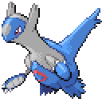
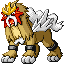

🏠 [`pokebot-gen3` Wiki Home](../Readme.md)

# 🏃 Roamer Reset Mode
Roamer reset mode helps with finding shiny roaming Pokémon via soft-resetting.

## Emerald

On Emerald, this mode needs some preparation **before defeating the Elite Four for the first time!**

- Make sure you have a Pokémon that knows **Fly** in your party
- Make sure you have a Pokémon **between level 14 and 40** in your party (in order for Repel to work properly)
   - If this Pokémon has the ability **Illuminate** or **Arena Trap**, it will speed up the hunt by about 18%. But this is not strictly necessary
- Make your you have some **repels** in your inventory. The mode will soft reset when it runs out of repels, but that makes it less efficient
   - To all but ensure you never run out of them, make sure to pack at least **40 Max Repels**, or **50 Super Repels**, or **100 Repels**, or a combination thereof
- After defeating the Elite Four for the first time, you will be sent back to your house in Littleroot Town. **Do not leave the upper floor of that house or you will not be able to use this mode with that save game!**
- Move a Pokémon between level 14 and 40 (see step 2) to the front of your party
- Save the game (**in-game, not a save state**)
- Start mode

## FireRed/LeafGreen

- Make sure you have a Pokémon that knows **Fly** in your party
- Make sure you have a Pokémon **between level 5 and 50** in your party (in order for Repel to work properly)
   - If this Pokémon has the ability **Illuminate** or **Arena Trap**, it will speed up the hunt by about 18%, but this is not strictly necessary
   - Move that Pokémon **to the front of your party**
- Make your you have some **repels** in your inventory
  - The mode will soft reset when it runs out of repels, but that makes it less efficient 
  - To all but ensure you never run out of them, make sure to pack at least **40 Max Repels**, or **50 Super Repels**, or **100 Repels**, or a combination thereof
- Go to the [**Pokémon Net Center**](https://bulbapedia.bulbagarden.net/wiki/Pok%C3%A9mon_Network_Center) on [**One Island**](https://bulbapedia.bulbagarden.net/wiki/One_Island_(town)) and stand on the **left** side of the scientist who is facing a big machine to the right
- Save the game (**in-game, not a save state**)
- Start mode

## Ruby/Sapphire

This mode does not yet support Ruby/Sapphire (save state is required for development).

## Game Support
|          | 🟥 Ruby | 🔷 Sapphire | 🟢 Emerald | 🔥 FireRed | 🌿 LeafGreen |
|:---------|:-------:|:-----------:|:----------:|:----------:|:------------:|
| English  |    ❌    |      ❌      |     ✅      |     ✅      |      ✅       |
| Japanese |    ❌    |      ❌      |     🟨     |     🟨     |      🟨      |
| German   |    ❌    |      ❌      |     🟨     |     🟨     |      🟨      |
| Spanish  |    ❌    |      ❌      |     🟨     |     🟨     |      🟨      |
| French   |    ❌    |      ❌      |     🟨     |     🟨     |      🟨      |
| Italian  |    ❌    |      ❌      |     🟨     |     🟨     |      🟨      |

✅ Supported (tested)

🟨 Supported (not tested)

❌ Not supported