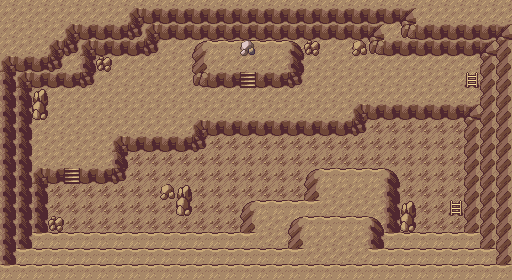
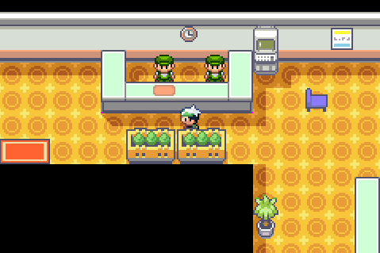

🏠 [`pokebot-gen3` Wiki Home](../Readme.md)

# 🪨 Rock Smash Mode

Rock smash mode will continuously farm Rock Smash encounters in Granite Cave (Nosepass) and Safari Zone (Shuckle).

## Granite Cave

- Go to the bottom floor of Granite Cave (B2F)
- Start mode

If your first party Pokémon is between levels 13 and 19 (inclusive) and you have some Repel in your inventory,
this mode will automatically use that.

For best encounter rates, it is recommended that you get yourself a Level-13 Volbeat on Route 117 that has
the ability **Illuminate** (for higher encounter rates.)

And then stock up on Max Repels. Lots of them.
Expect to use about one Max Repel per encounter on average when using the Repel strategy.

## Safari Zone

The mode will continuously try to enter the Safari Zone, so make sure you have some cash. The bot will use up to ₽25,000 and then soft reset to start over. If you have less cash than that, it will soft-reset when money runs out.

- Go to the _entrance_ of the Safari Zone (see image below)
- Make sure you have some cash on you
- Save the game (**in-game, not a save state**)
- Start mode

## Game Support
|          | 🟥 Ruby | 🔷 Sapphire | 🟢 Emerald | 🔥 FireRed | 🌿 LeafGreen |
|:---------|:-------:|:-----------:|:----------:|:----------:|:------------:|
| English  |    ❌    |      ❌      |     ✅      |     ❌      |      ❌       |
| Japanese |    ❌    |      ❌      |     🟨     |     ❌      |      ❌       |
| German   |    ❌    |      ❌      |     🟨     |     ❌      |      ❌       |
| Spanish  |    ❌    |      ❌      |     🟨     |     ❌      |      ❌       |
| French   |    ❌    |      ❌      |     🟨     |     ❌      |      ❌       |
| Italian  |    ❌    |      ❌      |     🟨     |     ❌      |      ❌       |

✅ Supported (tested)

🟨 Supported (not tested)

❌ Not supported
