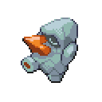

🏠 [`pokebot-gen3` Wiki Home](../Readme.md)

# 🪨 Rock Smash Mode

Rock smash mode will continuously farm Rock Smash encounters in Granite Cave (Nosepass) and Safari Zone (Shuckle).

## Granite Cave

You can use this mode either with or without Repel.  
If using Repel, the bot will use up any Repel items in your inventory and then reset once it ran out.

Using Repel on its own give a minor boost to encounter rates (around +5%), but if you have a **White Flute**
in your inventory, the bot will use that as well and in combination that can boost encounters by **up to 40%**.

If you have any Repel items in your inventory, the game will offer you this choice:

### Without Repel

- Go to the bottom floor of Granite Cave (B2F)
- Start mode

### With Repel

- Make sure you have some Repel in your inventory (Max Repel works best, but Super Repel or Repel will do.)  
  While the bot can work with as few as 1 Repel, having a few dozen will improve rates by spending less time resetting.
- Optional, but highly recommended: Get the White Flute.
- Make sure the first Pokémon in your party has level 13. The bot will accept Pokémon up to level 16, but 13 gives you
  the best rates.
- Go to the bottom floor of Granite Cave (B2F)
- **Save the game**
- Start mode and select 'Use Repel'

## Safari Zone

The mode will continuously try to enter the Safari Zone, so make sure you have some cash. The bot will use up to ₽25,000 and then soft reset to start over. If you have less cash than that, it will soft-reset when money runs out.

- Go to the _entrance_ of the Safari Zone (see image below)
- Make sure you have some cash on you
- Save the game (**in-game, not a save state**)
- Start mode

## Game Support
|          | 🟥 Ruby | 🔷 Sapphire | 🟢 Emerald | 🔥 FireRed | 🌿 LeafGreen |
|:---------|:-------:|:-----------:|:----------:|:----------:|:------------:|
| English  |    ❌    |      ❌      |     ✅      |     ❌      |      ❌       |
| Japanese |    ❌    |      ❌      |     🟨     |     ❌      |      ❌       |
| German   |    ❌    |      ❌      |     🟨     |     ❌      |      ❌       |
| Spanish  |    ❌    |      ❌      |     🟨     |     ❌      |      ❌       |
| French   |    ❌    |      ❌      |     🟨     |     ❌      |      ❌       |
| Italian  |    ❌    |      ❌      |     🟨     |     ❌      |      ❌       |

✅ Supported (tested)

🟨 Supported (not tested)

❌ Not supported
