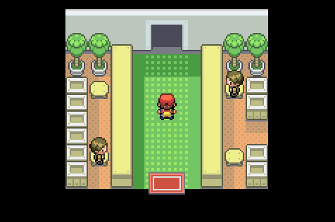
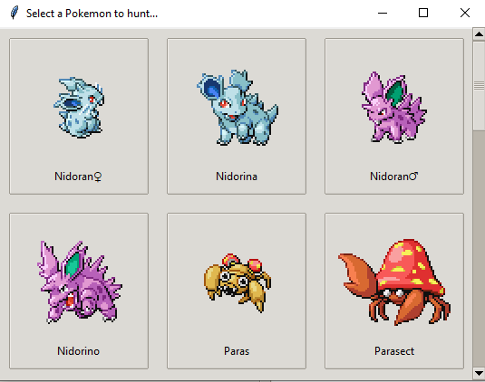
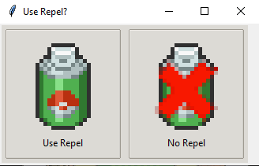

🏠 [`pokebot-gen3` Wiki Home](../Readme.md)

# 🏞️ Safari Mode

The **Safari Mode** allows you to continuously hunt Pokémon in the **Safari Zone**.

> **Note**: This mode is only available in **Pokémon FireRed** and **LeafGreen** versions. It does **not support Ruby, Sapphire, or Emerald** yet.

---

## How Safari Mode Works

Safari Mode lets you select a specific Pokémon to hunt in the Safari Zone. The bot navigates to a predefined tile and uses the best strategy to locate and catch the target Pokémon.

Safari Mode uses the appropriate hunting strategy based on the target Pokémon and its environment:

- **Spin**
- **Surf**
- **Fish**

---

## Requirements

Before starting Safari Mode, ensure you meet the following criteria:

1. **Save your game** at the Safari Zone entrance building in **Fuchsia City**.

2. **Have enough money**: You need more than ₽500 to start the hunt.
3. **Choose a Pokémon** to hunt from the available Safari Zone list.

4. **Decide whether to use Repel**, especially for Pokémon not hunted by Fishing. Since some targets are located far from the Safari entrance, ensure you have enough repels to do a full cycle (4 re-entries) before a soft reset.

---

## Mode Behavior

1. The bot navigates to the predefined tile for your selected target.
2. If a Pokémon of interest (e.g., Shiny or meeting a custom catch filter) appears, the bot will attempt to catch it.
3. If you used atleast one safari ball, the bot will exit the Safari and re-entry if you have enough money or soft reset. Since some Pokémon catching can take 20+ Safari balls, you might want to have a full bag when finding that Shiny Chansey.
3. Some Pokémon may require many Safari Balls (e.g., a Shiny Chansey). Ensure you have a full inventory.
4. After spending ₽25.000 without catching a Pokémon in the last 50 Safari runs, the bot will:
    - Perform a soft reset to save cash.
    - Or exit Safari Mode and switch to manual control for you to save your game if a Pokémon was captured during these 50 Safari runs.

---

## Game Support

|              | 🟥 Ruby | 🔷 Sapphire | 🟢 Emerald | 🔥 FireRed | 🌿 LeafGreen |
|:-------------|:-------:|:-----------:|:----------:|:----------:|:------------:|
| **English**  |    ❌    |      ❌      |     ❌      |     ✅      |      ✅       |
| **Japanese** |    ❌    |      ❌      |     ❌      |     ✅      |      ✅       |
| **German**   |    ❌    |      ❌      |     ❌      |     ✅      |      ✅       |
| **Spanish**  |    ❌    |      ❌      |     ❌      |     ✅      |      ✅       |
| **French**   |    ❌    |      ❌      |     ❌      |     ✅      |      ✅       |
| **Italian**  |    ❌    |      ❌      |     ❌      |     ✅      |      ✅       |

✅ Tested, working

🟨 Untested, may not work

❌ Untested, not working
