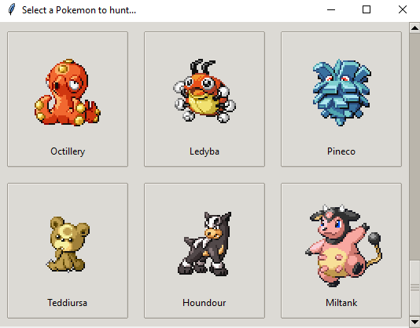

🏠 [`pokebot-gen3` Wiki Home](../Readme.md)

# 🏞️ Safari Mode

The **Safari Mode** allows you to continuously hunt Pokémon in the **Safari Zone**.

---

## How Safari Mode Works

Safari Mode lets you select a specific Pokémon to hunt in the Safari Zone. The bot navigates to a predefined tile and uses the best strategy to locate and catch the target Pokémon.

Safari Mode uses the appropriate hunting strategy based on the target Pokémon and its environment:

- **Spin**
- **Surf**
- **Fish**

---

## Requirements

Before starting Safari Mode, ensure you meet the following criteria:

1. **Save your game** at the Safari Zone entrance building at **Route 121** (`Ruby`/`Sapphire`/`Emerald`) or in **Fuchsia City** (`FireRed`/`LeafGreen`).

2. **Have enough money**: You need more than ₽500 to start the hunt.
3. **Choose a Pokémon** to hunt from the available Safari Zone list.

4. **Decide whether to use Repel**, especially for Pokémon not hunted by Fishing. Since some targets are located far from the Safari entrance, ensure you have enough repels to do a full cycle (4 re-entries) before a soft reset.

---

## Mode Behavior

1. The bot navigates to the predefined tile for your selected target.
2. If a Pokémon of interest (e.g., Shiny or meeting a custom catch filter) appears, the bot will attempt to catch it.

- `Ruby` / `Sapphire` / `Emerald`

The `auto_catch` Safari strategy for `Ruby` / `Sapphire` / `Emerald` is designed using an in-depth
[study](https://www.docdroid.net/oiHhrwd/hoenn-safari-zone-research-pdf), which calculate the most effective Pokéblock and Safari ball sequence for catching a Pokémon based on the Pokémon encountered.
The bot will use your Pokéblock case if you have some available to perform the strategy, or throw balls until the target is captured.

- `Fire Red` / `Leaf Green`

The `auto_catch` Safari strategy for `Fire Red` and `Leaf Green` is designed using an in-depth
[study](https://www.docdroid.net/Tx5NbeU/safari-zone-research-pdf),
which calculate the most effective sequence for catching a Pokémon based on both the Pokémon encountered and
the number of Safari Balls remaining at the start of the encounter.
The bot will use the best possible bait / ball strategy until the target is captured.

The bot uses optimal catch patterns, which are available in these
[lookup tables](https://www.docdroid.net/g3I5Qtl/frlg-lookup-tables-pdf), to maximize catch rates for each Pokémon.

3. If you used atleast one safari ball, the bot will exit the Safari and re-entry if you have enough money or soft reset. Since some Pokémon catching can take 20+ Safari balls, you might want to have a full bag when finding that Shiny Chansey.
4. After spending ₽15.000 without catching a Pokémon in the last 30 Safari runs, the bot will:
    - Perform a soft reset to save cash.
    - Or exit Safari Mode and switch to manual control for you to save your game if a Pokémon was captured during these 30 Safari runs.

---

## Game Support

|              | 🟥 Ruby | 🔷 Sapphire | 🟢 Emerald | 🔥 FireRed | 🌿 LeafGreen |
|:-------------|:-------:|:-----------:|:----------:|:----------:|:------------:|
| **English**  |    ✅    |      ✅      |     ✅      |     ✅      |      ✅       |
| **Japanese** |    ✅    |      ✅      |     ✅      |     ✅      |      ✅       |
| **German**   |    ✅    |      ✅      |     ✅      |     ✅      |      ✅       |
| **Spanish**  |    ✅    |      ✅      |     ✅      |     ✅      |      ✅       |
| **French**   |    ✅    |      ✅      |     ✅      |     ✅      |      ✅       |
| **Italian**  |    ✅    |      ✅      |     ✅      |     ✅      |      ✅       |

✅ Tested, working

🟨 Untested, may not work

❌ Untested, not working
