🏠 [`pokebot-gen3` Wiki Home](../Readme.md)

# 🎁 Static Gift Reset Mode

Soft reset for a static gift Pokémon that are directly added to your party without a battle.

- Place the player facing the source of the encounter (item or NPC)
- Save the game (**in-game, not a save state**)

## FireRed/LeafGreen

### Fossils: [Omanyte](<https://bulbapedia.bulbagarden.net/wiki/Omanyte_(Pok%C3%A9mon)>), [Kabuto](<https://bulbapedia.bulbagarden.net/wiki/Kabuto_(Pok%C3%A9mon)>), [Aerodactyl](<https://bulbapedia.bulbagarden.net/wiki/Aerodactyl_(Pok%C3%A9mon)>)

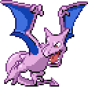

- Place the player in front of the Scientist in the Eastern most room of [Cinnibar Lab](https://bulbapedia.bulbagarden.net/wiki/Cinnabar_Island#Cinnabar_Lab)
- **Note**: You must have already walked enough steps for the fossil to be reanimated and be ready for collection!
- The scientist may be trapped on either of the two marked tiles, please stand facing these to activate the mode
- Save the game (**in-game, not a save state**)
- Start mode

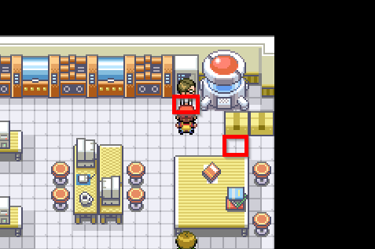

### [Eevee](<https://bulbapedia.bulbagarden.net/wiki/Eevee_(Pok%C3%A9mon)>)

- Place the player in front of Eevee's Pokéball in the top floor room of [Celadon Mansion](https://bulbapedia.bulbagarden.net/wiki/Celadon_Condominiums)
- Save the game (**in-game, not a save state**)
- Start mode

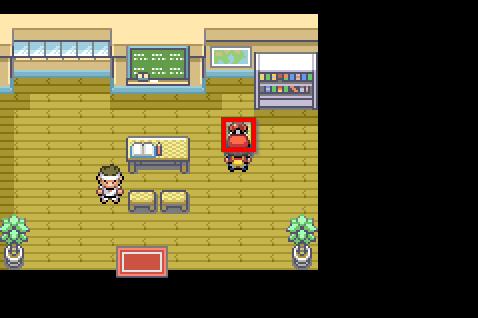

### [Hitmonchan](<https://bulbapedia.bulbagarden.net/wiki/Hitmonchan_(Pok%C3%A9mon)>), [Hitmonlee](<https://bulbapedia.bulbagarden.net/wiki/Hitmonlee_(Pok%C3%A9mon)>)

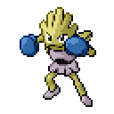

- Place the player in front of the respective Pokéball in the [Fighting Dojo](https://bulbapedia.bulbagarden.net/wiki/Fighting_Dojo)
- Save the game (**in-game, not a save state**)
- Start mode

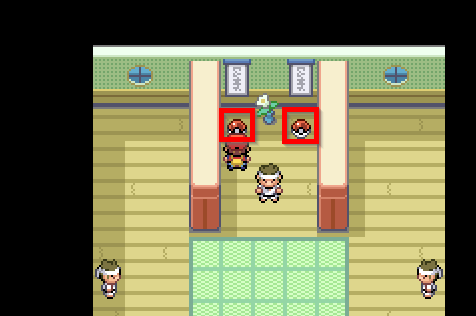

### [Lapras](<https://bulbapedia.bulbagarden.net/wiki/Lapras_(Pok%C3%A9mon)>)

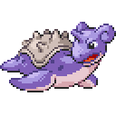

- Place the player in front of the NPC in [Silph Co.](https://bulbapedia.bulbagarden.net/wiki/Silph_Co.)
- Save the game (**in-game, not a save state**)
- Start mode

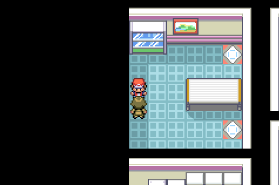

### [Magikarp](<https://bulbapedia.bulbagarden.net/wiki/Magikarp_(Pok%C3%A9mon)>)

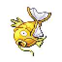

- Place the player in front of the NPC in [Route 4 Pokémon Center](https://bulbapedia.bulbagarden.net/wiki/Kanto_Route_4), with at least ₽500
- Save the game (**in-game, not a save state**)
- Start mode

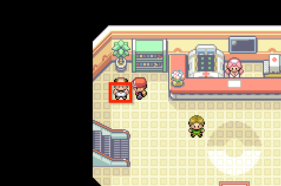

### [Togepi](<https://bulbapedia.bulbagarden.net/wiki/Togepi_(Pok%C3%A9mon)>)

- Place the player in front of the Old Man in the [Water Labyrinth](https://bulbapedia.bulbagarden.net/wiki/Water_Labyrinth) just west of [Five Island](https://bulbapedia.bulbagarden.net/wiki/Five_Island)
- Register [Bicycle]() to the `Select` button
- Make sure you have defeated the female trainer on the island
- Lead Pokémon must have max friendship (255) to receive the egg
- **Note**: This mode will be low encounters per hour. For optimal hatching rates, it is recommended to use the Daycare Mode in Emerald, once released.

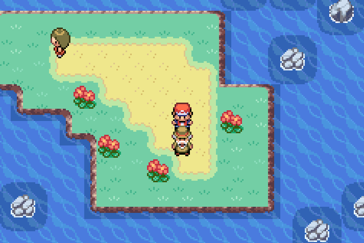

## Emerald

### [Castform](<https://bulbapedia.bulbagarden.net/wiki/Castform_(Pok%C3%A9mon)>)

**Note**:

> In order to get the game into a state for soft resetting, you must save before the Team Aqua battle, and fill BOTH your PC and party.
> If any spaces are in your party or any PC box, Castform will be force gifted to you upon completion of the fight.
>
> Doing this correctly will mean you can save before speaking to the staff to receive the Castform, and can soft reset as normal.
> If the NPC is not in the correct location, leave the building and return.

- Place the player in front of the scientist in the [Weather Institute](https://bulbapedia.bulbagarden.net/wiki/Weather_Institute)
- Save the game (**in-game, not a save state**)
- Start mode

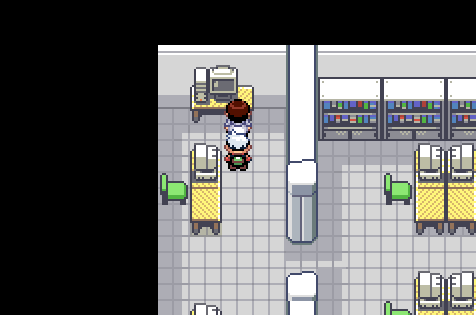

### [Beldum](<https://bulbapedia.bulbagarden.net/wiki/Beldum_(Pok%C3%A9mon)>)

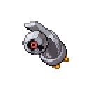

- Place the player in front of Beldum's Pokéball in [Steven's House](https://bulbapedia.bulbagarden.net/wiki/Mossdeep_City#Steven.27s_house) after beating the Elite Four
- Save the game (**in-game, not a save state**)
- Start mode

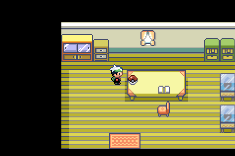

### [Lileep](<https://bulbapedia.bulbagarden.net/wiki/Lileep_(Pok%C3%A9mon)>), [Anorith](<https://bulbapedia.bulbagarden.net/wiki/Anorith_(Pok%C3%A9mon)>)

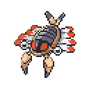
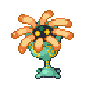

- Place the player in front of the Scientist in the [Devon Corporation](https://bulbapedia.bulbagarden.net/wiki/Devon_Corporation)
- **Note**: You must have already walked enough steps for the fossil to be reanimated and be ready for collection
- Save the game (**in-game, not a save state**)
- Start mode

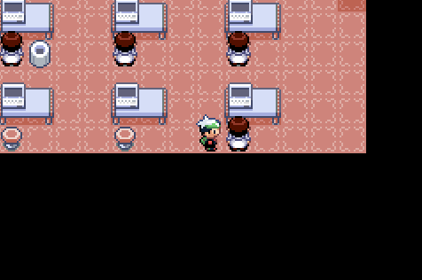

### [Wynaut](<https://bulbapedia.bulbagarden.net/wiki/Wynaut_(Pok%C3%A9mon)>)

- Place the player in front of the old biddy in [Lavaridge Town](https://bulbapedia.bulbagarden.net/wiki/Lavaridge_Town)
- Register [Mach Bike](https://bulbapedia.bulbagarden.net/wiki/Mach_Bike) to the `Select` button
- **Note**: You will get a warning if you do not have a Pokémon with [Flame Body](<https://bulbapedia.bulbagarden.net/wiki/Flame_Body_(Ability)>) or [Magma Armor](<https://bulbapedia.bulbagarden.net/wiki/Magma_Armor_(Ability)>) ability in your party
- Save the game (**in-game, not a save state**)
- Start mode

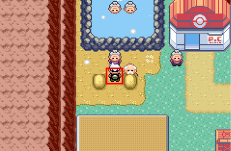

## Game Support

|          | 🟥 Ruby | 🔷 Sapphire | 🟢 Emerald | 🔥 FireRed | 🌿 LeafGreen |
| :------- | :-----: | :---------: | :--------: | :--------: | :----------: |
| English  |   🟨    |     🟨      |     ✅     |     ✅     |      ✅      |
| Japanese |   ❌    |     ❌      |     ❌     |     ❌     |      ❌      |
| German   |   ❌    |     ❌      |     ❌     |     ❌     |      ❌      |
| Spanish  |   ❌    |     ❌      |     ❌     |     ❌     |      ❌      |
| French   |   ❌    |     ❌      |     ❌     |     ❌     |      ❌      |
| Italian  |   ❌    |     ❌      |     ❌     |     ❌     |      ❌      |

✅ Tested, working

🟨 Untested, may not work

❌ Untested, not working
