🏠 [`pokebot-gen3` Wiki Home](../Readme.md)

# 🏃🏼 Static Run Away Mode

Static run away mode will hunt the [Tower duo Pokémon](https://bulbapedia.bulbagarden.net/wiki/List_of_in-game_event_Pok%C3%A9mon_(FireRed_and_LeafGreen)#Lugia_and_Ho-Oh), the [Regi Trio](https://bulbapedia.bulbagarden.net/wiki/Legendary_giants#Pok.C3.A9mon_Ruby.2C_Sapphire.2C_Emerald.2C_Omega_Ruby.2C_and_Alpha_Sapphire), [Super-Ancient Pokémon](https://bulbapedia.bulbagarden.net/wiki/Legendary_Pok%C3%A9mon#Super-ancient_Pok.C3.A9mon), and the [Eon Duo](https://bulbapedia.bulbagarden.net/wiki/Eon_duo) on Southern Isle.

After fleeing from a legendary encounter and reloading the map, the Pokémon will respawn. This mode will use the runaway method as it is generally faster when compared to soft-resets due to not having to wait for a unique frame after every reset.

**IMPORTANT NOTE:**
You must set `pickup: false` in `battle.yml` to use this mode. See [⚔ Battling and Pickup config](Configuration%20-%20Battling%20and%20Pickup.md).

## [Lugia](https://bulbapedia.bulbagarden.net/wiki/Lugia_(Pok%C3%A9mon))

- Place the player in front of Lugia in [Navel Rock](https://bulbapedia.bulbagarden.net/wiki/Navel_Rock)
- Start mode

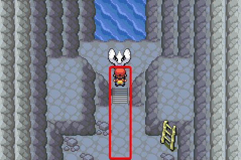

## [Ho-Oh](https://bulbapedia.bulbagarden.net/wiki/Ho-Oh_(Pok%C3%A9mon))

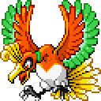

- Place the player in front of Ho-Oh on [Navel Rock](https://bulbapedia.bulbagarden.net/wiki/Navel_Rock)
- Start mode

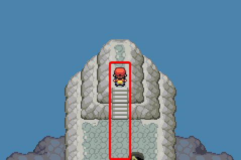

## [Regice](https://bulbapedia.bulbagarden.net/wiki/Regice_(Pok%C3%A9mon))

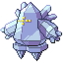

- Place the player in front of Regice in [Island Cave](https://bulbapedia.bulbagarden.net/wiki/Island_Cave)
- Start mode

## [Regrock_](https://bulbapedia.bulbagarden.net/wiki/Regrock_(Pok%C3%A9mon))

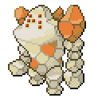

- Place the player in front of Regrock in [Desert Ruins](https://bulbapedia.bulbagarden.net/wiki/Desert_Ruins)
- Start mode

## [Registeel](https://bulbapedia.bulbagarden.net/wiki/Registeel_(Pok%C3%A9mon))

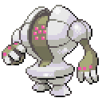

- Place the player in front of Registeel in [Ancient Tomb](https://bulbapedia.bulbagarden.net/wiki/Ancient_Tomb)
- Start mode

## [Kyogre](https://bulbapedia.bulbagarden.net/wiki/Kyogre_(Pok%C3%A9mon))

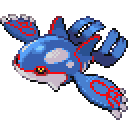 

- Place the player anywhere on the platform in [Marine Cave](https://bulbapedia.bulbagarden.net/wiki/Marine_Cave), in front of Kyogre
- Start mode

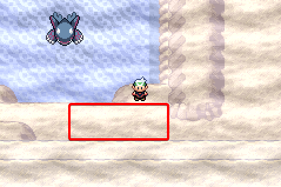

## [Groudon](https://bulbapedia.bulbagarden.net/wiki/Groudon_(Pok%C3%A9mon))

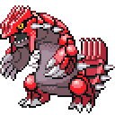 

- Place the player anywhere on the platform in [Terra Cave](https://bulbapedia.bulbagarden.net/wiki/Terra_Cave), in front of Groudon
- Start mode

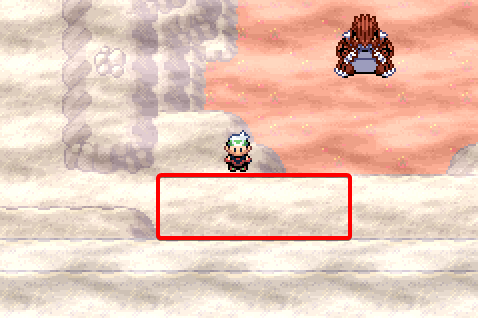

## [Rayquaza](https://bulbapedia.bulbagarden.net/wiki/Rayquaza_(Pok%C3%A9mon))

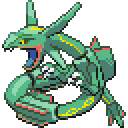

- Place the player at the top of [Sky Pillar](https://bulbapedia.bulbagarden.net/wiki/Sky_Pillar), facing Rayquaza
- Start mode

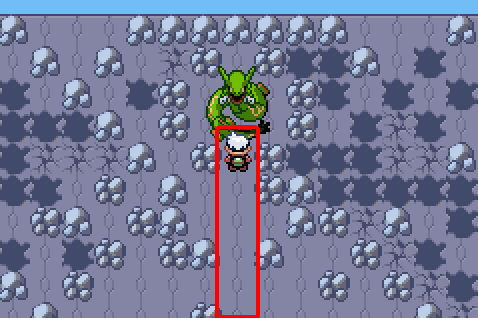

## [Latias](https://bulbapedia.bulbagarden.net/wiki/Latias_(Pok%C3%A9mon)) and [Latios](https://bulbapedia.bulbagarden.net/wiki/Latios_(Pok%C3%A9mon))

- Catch the other roamer using [Roamer Resets](Mode%20-%20Roamer%20Resets.md) mode
- Place the player in the encounter area on [Southern Island](https://bulbapedia.bulbagarden.net/wiki/Southern_Island)
- Start mode

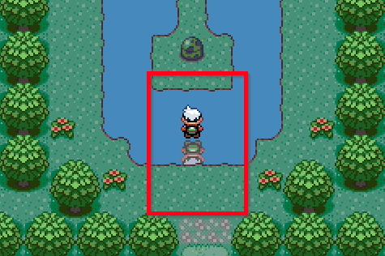

## [Mew](https://bulbapedia.bulbagarden.net/wiki/Mew_(Pok%C3%A9mon)) 

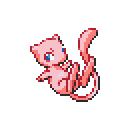

- Stand on the **left** tile outside the forest on [Faraway Island](https://bulbapedia.bulbagarden.net/wiki/Faraway_Island)
- Start mode

# Game Support
|          | 🟢 Emerald | 🔥 FireRed | 🌿 LeafGreen |
|:---------|:----------:|:----------:|:------------:|
| English  |     ✅      |     ✅      |      ✅       |
| Japanese |    🟨    |    🟨    |     🟨     |
| German   |    🟨    |    🟨    |     🟨     |
| Spanish  |    🟨    |    🟨    |     🟨     |
| French   |    🟨    |    🟨    |     🟨     |
| Italian  |    🟨    |    🟨    |     🟨     |

✅ Supported (tested)

🟨 Supported (not tested)

❌ Not supported