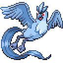
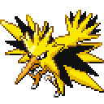
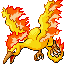
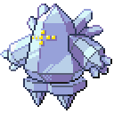
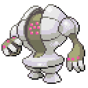
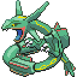
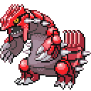

🏠 [`pokebot-gen3` Wiki Home](../Readme.md)

# ♻ Static Soft Reset Mode

> For modes that use soft resets such as starters, the bot will track RNG to ensure a unique frame is hit after every reset, this is to prevent repeatedly generating an identical Pokémon, this will cause soft resets to take progressively longer over time
>
> If resets begin to take too long, it is recommended to start a new save file with a different TID to reset this delay or check out [💎 Cheats](Configuration%20-%20Cheats.md) (`random_soft_reset_rng`)

Static soft reset mode targets static Pokémon by simply spamming the A button until a battle starts, it is not useful for static Pokémon that require extra menuing (see [static gift reset mode](Mode%20-%20Static%20Gift%20Resets.md)).

- Place the player, facing any static Pokémon
- Save the game (**in-game, not a save state**)
- Start mode

### Kyogre (Sapphire Only)

- Place the Player in the Cave of Origin facing the tile _before_ the encounter triggers.

### Groudon (Ruby Only)

- Place the Player in the Cave of Origin facing the tile _before_ the encounter triggers.

# Game Support

|          | 🟥 Ruby | 🔷 Sapphire | 🟢 Emerald | 🔥 FireRed | 🌿 LeafGreen |
| :------- | :-----: | :---------: | :--------: | :--------: | :----------: |
| English  |   🟨    |     🟨      |     ✅     |     ✅     |      ✅      |
| Japanese |   🟨    |     🟨      |     🟨     |     🟨     |      🟨      |
| German   |   🟨    |     🟨      |     🟨     |     🟨     |      🟨      |
| Spanish  |   🟨    |     🟨      |     🟨     |     🟨     |      🟨      |
| French   |   🟨    |     🟨      |     🟨     |     🟨     |      🟨      |
| Italian  |   🟨    |     🟨      |     🟨     |     🟨     |      🟨      |

✅ Supported (tested)

🟨 Supported (not tested)

❌ Not supported
