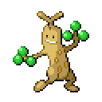

🏠 [`pokebot-gen3` Wiki Home](../Readme.md)

# 🥦 Sudowoodo Mode

- Register the [Wailmer Pail](https://bulbapedia.bulbagarden.net/wiki/Wailmer_Pail) to the `Select` button
- Face [Sudowoodo](https://bulbapedia.bulbagarden.net/wiki/Sudowoodo_(Pok%C3%A9mon)) at the [Battle Frontier](https://bulbapedia.bulbagarden.net/wiki/Battle_Frontier_(Generation_III))
- Save the game (**in-game, not a save state**)
- Start mode

# Game Support
|          | 🟢 Emerald |
|:---------|:----------:|
| English  |     ✅      |
| Japanese |     🟨     |
| German   |     🟨     |
| Spanish  |     🟨     |
| French   |     🟨     |
| Italian  |     🟨     |

✅ Supported (tested)

🟨 Supported (not tested)

❌ Not supported