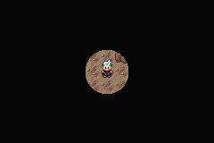
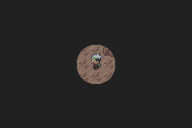
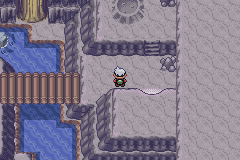
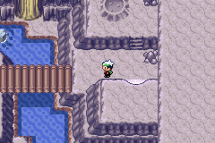
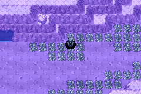
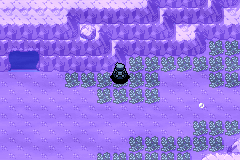
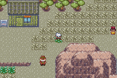
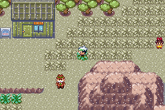

🏠 [`pokebot-gen3` Wiki Home](../Readme.md)

# Battle Transitions

This page attempts to document possible wild encounter battle transitions and their duration in frames for each game, these can be useful to ensure maximum encounters per hour for a given hunt. 

The battle transition animation that plays before a battle is usually different depending on the level of your party's lead Pokémon and the opponent.

These were measured with the bot in debug mode, measuring the duration in frames that the task `Task_BattleTransition` is active.

**Note**: the gifs exported by the bot, displayed below are not exactly 60 fps due to a limitation with PIL.

## Emerald

| Scenario                                                              | Duration       | Battle Transition                        |
|-----------------------------------------------------------------------|----------------|------------------------------------------|
| Poorly lit cave, encounter lower level than party lead                | **123** frames |  |
| Poorly lit cave, encounter equal or higher level than party lead      | **106** frames |  |
| Cave, encounter lower level than party lead                           | **123** frames |  |
| Cave, encounter equal or higher level than party lead                 | **106** frames |  |
| Surfing or diving, encounter lower level than party lead              | **85** frames  |  |
| Surfing or diving, encounter equal or higher level than party lead    | **145** frames |  |
| Overworld or fishing, encounter lower level than party lead           | **88** frames  |  |
| Overworld or fishing, encounter equal or higher level than party lead | **152** frames |  |
