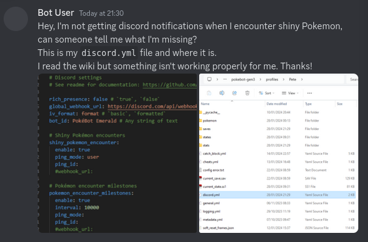

🏠 [`pokebot-gen3` Wiki Home](../Readme.md)

# 🆘 Reporting an Issue

If you're having issues with the bot, please follow the below steps to report an issue.

- Carefully read the [wiki](../Readme.md) page for the bot mode you are using, or configuration you're trying to change
    - Read the page thoroughly, and follow all steps

- If you're still having issues, please provide the following information in [#pokebot-gen3-support❔](https://discord.com/channels/1057088810950860850/1139190426834833528) channel in the Discord
    - A screenshot of any error messages in the console window
    - A screenshot of the relevant config file

- For Discord config issues (`discord.yml`) - **make sure you remove any sensitive `webhook_url` values if you're providing this screenshot**
- A screenshot of your profiles folder structure `./profiles/40Cakes/`, showing where the files are located
- An explanation of both expected behaviour, and what your bot is doing. If you can screen record it, even better!
- Wait for a response (please be patient), the volunteers who support do so in their free time, across multiple timezones

### Examples 

#### ❌ Example of a bad report

This gives us no indication of what you've tried, how your config file is set up, or what is happening.    
This means we need to spend time asking for more information, which slows down support.

#### ✅ Example of a good report

Here, we can immediately see issues in the config, and we can see where the file is. This means we can usually solve the issue within a couple of minutes.     
_In this example, you can see `iv_format: format` should be `iv_format: formatted`, and also no `ping_id: ` was provided!_
